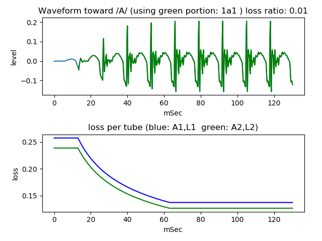

# vocal tract tube noise model   
   
This is an experiment to generate plosive voice /ga/ /ka/ sound by pseudo blast impulse, noise source instead of turbulent sound, and two tubes model with loss.  
  
[github repository](https://github.com/shun60s/Vocal-Tube-Noise-K-Model)  

## usage   

Generate following vowel sound, using two tubes model with loss   
```
python3 main2varloss_1a.py
```
  


Generate preceding noise sound, using perlin noise  
```
python3 PerlinNoise.py
```
  


Generate pseudo blast impulse and mix with the noise sound  
```
python3 mix_impulse.py
```
  


Apply resonance effect to the mixed sound  
```
python3 main2noiseresona_ku.py
```
  


Combine preceding mixed sound and following vowel sound  
```
python3 make_gka.py
```
  

It will save gka_1a1_varloss0_0_noise0_i40_s600_resona_0.wav that sounds similar to voice /ga/ sound  
and wii save gka_1a1_varloss0_01_noise0_i40_s600_resona_0.wav that becomes unvoiced sound.  


## Document  

For more information, please see related WEB [Plosive voice /ga/ /ka/ sound waveform generation by pseudo blast impulse, noise source, and two tubes model](https://wsignal.sakura.ne.jp/onsei2007/python5-e.html) or
[same content in Japanese](https://wsignal.sakura.ne.jp/onsei2007/python5.html)  


## License    
MIT  
Regarding to PerlinNoise.py, please follow the notice in the source code. 
